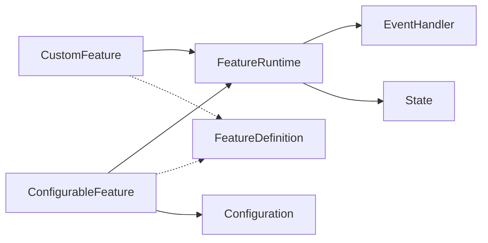
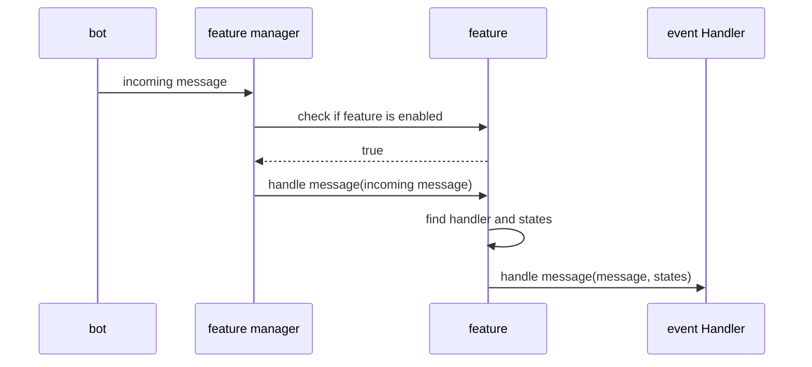

# Feature
## What is a feature
A feature is a group of event handler, possibly with a state, which provides a coherent behavior for the user. It is the main abstraction of the bot, and is the main way to extend the bot.

### FeatureDefinition
Base interface for all features. It is used to register the feature in the bot.
### CustomFeature
A feature configurable via the code. Can be registered only when the bot is starting.
### ConfigurableFeature
A configurable feature is a feature which can be configured by the user from the UI.
### Configuration
A POJO (no behavior) which contains all the information needed to build the feature. It is serializable to be passed to UI.
### FeatureBuilder
Create the feature runtime from the definition. The principal role of this class is to get the states from the different place (feature, bot, connector...) and to instanciate all the event handlers. 

## Feature manager
Global handle of all features : enable/disable, register, CRUD, dispatch events (incoming/outgoing), etc...

### When receiving an incoming message
