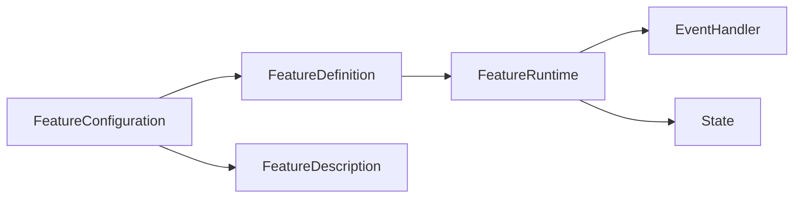
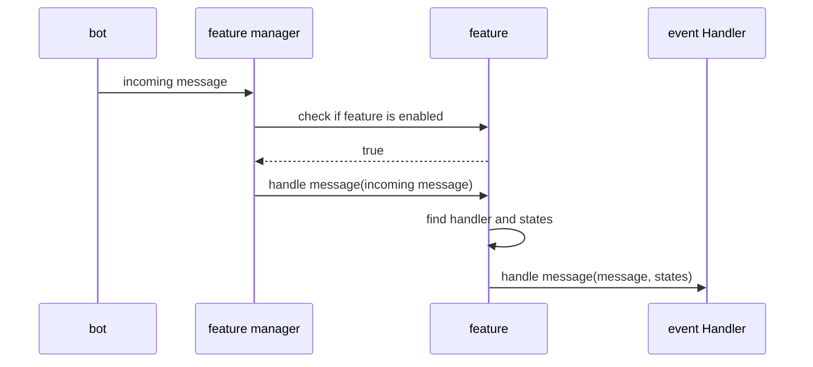

# Feature
## What is a feature
A feature is a group of event handler, possibly with somes states, which provides a coherent behavior for the user. It is the main abstraction of the bot, and is the main way to extend the bot.

### FeatureDefinition
Base interface for all features. It is used to register the feature in the bot.

###  [FeatureDefinition](bot-core/src/main/kotlin/fr/delphes/rework/feature/FeatureDefinition.kt)
Used in two ways :
- A feature configurable via the code. Can be registered only when the bot is starting via bot constructor
- A feature configurable at run time, via the [features manager](/bot-core/src/main/kotlin/fr/delphes/feature/FeaturesManager.kt). 
### [FeatureRuntime](bot-core/src/main/kotlin/fr/delphes/rework/feature/FeatureRuntime.kt)
It contains all the states and the event handlers. It is the class which is used by the bot to handle the incoming messages.
### [FeatureConfiguration](/bot-core/src/main/kotlin/fr/delphes/feature/FeatureConfiguration.kt)
A serializable version of feature definition hich contains all the information needed to build the definition.
### FeatureDescription
Contains all the information needed to build the UI for the feature configuration.

## Feature manager
Global handle of all features : enable/disable, register, CRUD, dispatch events (incoming/outgoing), etc...

### When receiving an incoming message
